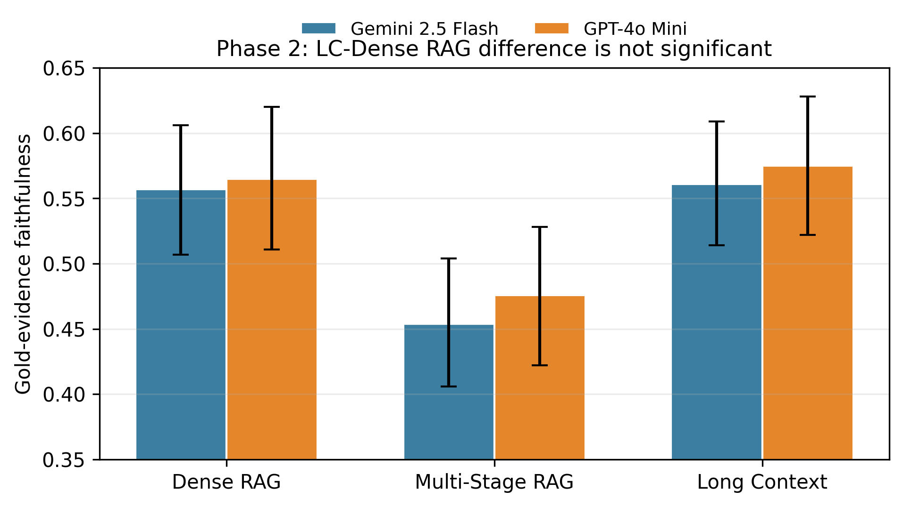
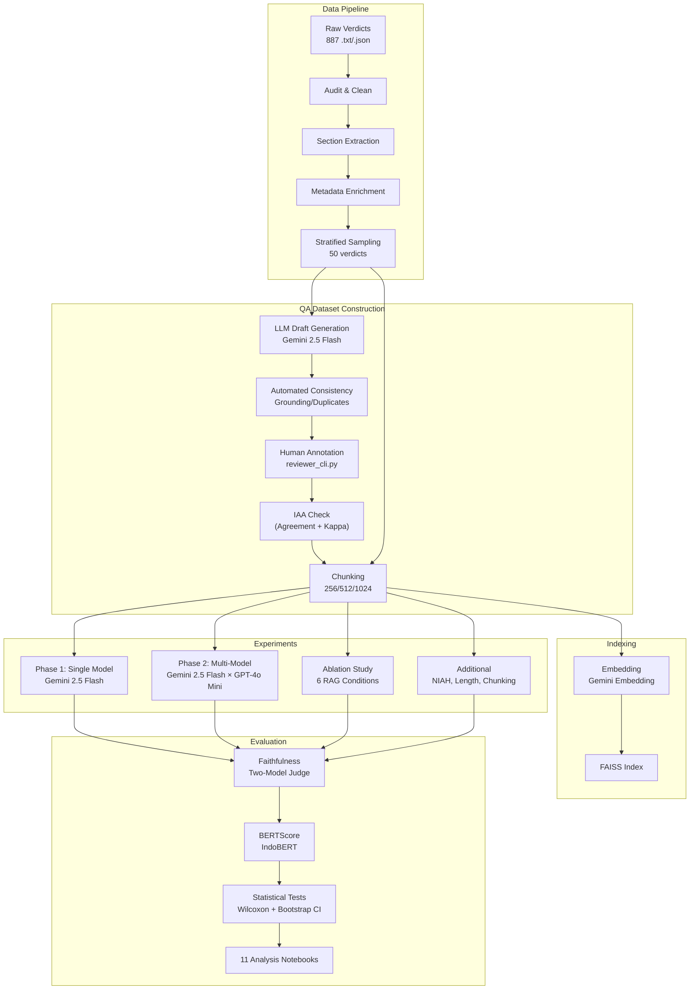

# VerdictBench: Long Context vs RAG on Indonesian Constitutional Court Verdicts

[](https://openreview.net/forum?id=1Z6OUt0T6Q)
[](https://doi.org/10.5281/zenodo.20086806)
[]()


> **"When Context Is Not Enough: Benchmarking Long Context and Retrieval-Augmented Generation on Indonesian Constitutional Court Verdicts"**

**Preprints:**
- **OpenReview**: https://openreview.net/forum?id=1Z6OUt0T6Q
- **Zenodo**: https://doi.org/10.5281/zenodo.20086806
- **arXiv**: Pending endorsement (cs.CL)

**Status:** Submitted to AACL-IJCNLP 2026

## Quick Links
- [Results & Figures](#results--analysis)
- [Public Release Artifacts](public_release/)
- [Installation](#quickstart)
- [Paper (OpenReview)](https://openreview.net/forum?id=1Z6OUt0T6Q)

---

## Abstract

The recent expansion of large language model (LLM) context windows raises a practical question for document-grounded question answering: if an entire source document fits into the prompt, is retrieval-augmented generation (RAG) still necessary?

VerdictBench evaluates this on 50 Indonesian Constitutional Court verdicts and 300 human-reviewed QA pairs. After auditing a Long Context faithfulness-evaluation bug, **the Phase 2 faithfulness difference between Long Context and Dense RAG is small and not statistically significant**, while Dense RAG remains 16-25x cheaper and avoids the long-verdict non-response failures seen in Phase 1.

**Key findings:**
- Phase 2 ordering under gold-evidence faithfulness: Long Context ~= Dense RAG > Multi-Stage RAG.
- Dense RAG is 24.8x cheaper than Long Context under Gemini Flash and 16.3x cheaper under GPT-4o Mini.
- In Phase 1, all 51 Long Context quota failures occurred in the long-verdict stratum.
- Multi-Stage RAG components reduced gold-evidence faithfulness relative to the Dense RAG baseline; cross-encoder reranking remains a domain-transfer risk.

---

> *Research codebase and benchmark for comparing Long Context, Dense RAG, and Multi-Stage RAG on Indonesian constitutional legal text -- 50 verdicts, 300 QA pairs, and publication-oriented analysis artifacts.*

## Overview

This repository contains the **full research pipeline** for an empirical study comparing three LLM-based QA architectures on a corpus of 50 Indonesian Constitutional Court (*Mahkamah Konstitusi*, MK) verdicts.



*Figure. Under gold-evidence faithfulness, Long Context and Dense RAG overlap strongly across both model families; Multi-Stage RAG is consistently lower.*

## Privacy & Public Data Release

Raw verdict text, sectioned verdict JSON, reviewed QA rows, generated answers, retrieved chunks, gold evidence paragraphs, annotation databases, and per-query result JSONL are **not redistributed** in the public repository. These artifacts can contain personal data present in public court documents, including names, addresses, occupations, identity-number references, and party details.

The public release instead provides source code, paper artifacts, figures, aggregate result tables, and a privacy-minimized verdict manifest in [**public_release/**](public_release/). To reproduce the private working dataset, use the reconstruction pipeline against official MKRI sources and keep generated data local.

## Start Here

If you are new to the repository, use this reading order:

1. [**README.md**](README.md): project overview, main findings, and how to run the core pipeline.
2. [**Paper.md**](Paper.md): paper-style narrative grounded in committed artifacts.
3. [**CORRECTION_NOTE.md**](CORRECTION_NOTE.md): details of the faithfulness-evaluation correction.
4. [**Runbook.md**](Runbook.md): end-to-end execution guide for rebuilding the corpus, rerunning experiments, and troubleshooting.
5. [**Structure.md**](Structure.md): file-by-file map of the repository layout.
6. [`public_release/`](public_release): aggregate public results and privacy-minimized manifest.

If you only want the shortest possible path:

- To understand the current research claim, read [**Paper.md**](Paper.md).
- To understand what changed after the audit, read [**CORRECTION_NOTE.md**](CORRECTION_NOTE.md).
- To reproduce the pipeline, follow [**Runbook.md**](Runbook.md).
- To navigate the codebase, open [**Structure.md**](Structure.md).

### Research Questions

1. **RQ1** -- Does Long Context outperform retrieval when the entire document fits within the context window?
2. **RQ2** -- How does verdict length affect faithfulness quality and operational completeness?
3. **RQ3** -- Which Multi-Stage RAG components improve or degrade faithfulness?
4. **RQ4** -- How does the choice of LLM (Gemini 2.5 Flash vs GPT-4o Mini) interact with architectural choice?

### Architectures Compared

| Architecture | Description | Context Strategy |
|:---|:---|:---|
| **Long Context (LC)** | Full verdict injected into prompt | Up to 1M tokens (Gemini) |
| **Dense RAG** | Historical `simple_rag` condition: fixed-size chunking + dense FAISS top-k retrieval | 512-token chunks, top-5 |
| **Multi-Stage RAG** | Historical `advanced_rag` condition: query rewriting + metadata filtering + hybrid retrieval + reranking | QR + MF + HS + RR |

The repository keeps `simple_rag` and `advanced_rag` in code and result paths for reproducibility. The paper-facing names are more precise: `Dense RAG` describes the baseline retrieval mechanism, while `Multi-Stage RAG` avoids implying that the larger pipeline is inherently better.

### Quality Assurance
To ensure maximum scientific validity, the dataset generation pipeline enforces strict validation:
- **Human IAA (Agreement + Kappa)**: A 10% overlap sample is independently annotated and reported with observed agreement, Cohen's kappa, and label distribution.
- **Automated Consistency Checks**: Surgical AI scripts verify verbatim grounding and detect semantic duplications before human annotation.
---

## 📐 Architecture



---

## 🚀 Quickstart

### Prerequisites

| Requirement | Version | Notes |
|:---|:---|:---|
| Python | ≥ 3.10 | `python --version` |
| uv | latest | `pip install uv` or `curl -LsSf https://astral.sh/uv/install.sh \| sh` |
| Google API Key | — | [aistudio.google.com](https://aistudio.google.com) |
| OpenAI API Key | — | [platform.openai.com](https://platform.openai.com) |
| LangExtract outputs | 887 verdicts | `.txt` + `.json` pairs |
| Disk space | ~2 GB | for embeddings and results |

### Installation

```bash
# Clone repository
git clone https://github.com/yourusername/lc-vs-rag-mk-verdicts.git
cd lc-vs-rag-mk-verdicts

# Install dependencies (recommended)
uv sync

# Or with pip
pip install -r requirements.txt
```

### Configuration

```bash
# Copy environment template
cp .env.example .env    # Linux/macOS
copy .env.example .env  # Windows CMD
```

Edit `.env` and fill in your API keys:

```env
GOOGLE_API_KEY=your_google_api_key_here
OPENAI_API_KEY=your_openai_api_key_here
PHASE1_MODEL=models/gemini-2.5-flash
EMBEDDING_MODEL=models/gemini-embedding-2-preview
```

### Quick Pipeline

```bash
# 1. Build corpus (audit → clean → section → metadata → sample)
uv run python -m src.data.audit
uv run python -m src.data.cleaner
uv run python -m src.data.section_extractor
uv run python -m src.data.metadata_enricher
uv run python -m src.data.sampler

# 2. Build FAISS indexes for the 50 sampled verdicts
uv run python -m src.indexing.vector_store --all

# 3. Generate QA drafts (LLM-assisted, ~35 min)
uv run python -m src.qa.generator

# 4. Human review (~2-4 hours)
uv run python -m src.qa.reviewer_cli

# 5. Run Phase 1 experiment
uv run python experiments/run_phase1.py

# 6. Analyze results
uv run jupyter notebook notebooks/04_phase1_results.ipynb
```

> For the complete step-by-step guide with troubleshooting, see [**Runbook.md**](Runbook.md). For the paper-style write-up, see [**Paper.md**](Paper.md).

---

## 📁 Repository Structure

```
lc-vs-rag-mk-verdicts/
│
├── README.md
├── LICENSE
├── .gitignore
├── requirements.txt
├── pyproject.toml
├── .env.example                          # API keys template (never commit .env)
│
│
├── data/
│   ├── README.md                         # explains folder structure + data sources
│   │
│   ├── raw/                              # ← FROM LANGEXTRACT (gitignored, ~887 files each)
│   │   ├── txt/
│   │   │   ├── 1_PUU-XIX_2021.txt
│   │   │   └── ...
│   │   └── json/
│   │       ├── 1_PUU-XIX_2021.json
│   │       └── ...
│   │
│   ├── processed/
│   │   ├── cleaned/                      # after text normalization (hyphen fix, CRLF, page nums)
│   │   │   └── .gitkeep
│   │   ├── sectioned/                    # per-verdict JSON with [X.X] sections extracted
│   │   │   └── .gitkeep
│   │   └── embedded/                     # FAISS index + embedding cache (gitignored)
│   │       └── .gitkeep
│   │
│   ├── metadata/
│   │   ├── corpus_stats.csv              # full 887-verdict audit output
│   │   ├── verdicts_metadata.csv         # enriched metadata (from json + text extraction)
│   │   ├── amar_mismatches.csv           # verdicts where JSON amar ≠ text amar (QC flag)
│   │   └── sample_50.csv                 # final stratified 50-verdict sample with strata labels
│   │
│   └── qa_dataset/
│       ├── schema.md                     # field definitions for all QA JSONL files
│       ├── qa_pairs_full.jsonl           # ~350 pairs, all 50 verdicts
│       ├── qa_pairs_ablation.jsonl       # 100-pair stratified subset for ablation
│       ├── qa_pairs_niah.jsonl           # 30 needle-in-a-haystack questions
│       └── qa_pairs_knowledge_update.jsonl  # 3 new verdicts × ~7 questions
│
│
├── src/
│   ├── __init__.py
│   │
│   ├── data/
│   │   ├── __init__.py
│   │   ├── audit.py                      # corpus_stats.csv generator — runs across all 887
│   │   ├── cleaner.py                    # normalize CRLF, fix PDF hyphen breaks, strip page nums
│   │   ├── section_extractor.py          # [X.X] → named sections dict per verdict
│   │   ├── metadata_enricher.py          # merge JSON metadata + text-derived fields
│   │   └── sampler.py                    # stratified 50-verdict sample from corpus_stats
│   │
│   ├── qa/
│   │   ├── __init__.py
│   │   ├── generator.py                  # LLM-assisted QA draft generation (non-evaluator model)
│   │   ├── reviewer_cli.py               # human review: accept / modify / reject per question
│   │   └── iaa_calculator.py             # inter-annotator agreement (Cohen's kappa)
│   │
│   ├── indexing/
│   │   ├── __init__.py
│   │   ├── chunkers/
│   │   │   ├── __init__.py
│   │   │   ├── fixed_size.py             # recursive character splitter (256/512/1024 tokens)
│   │   │   └── section_boundary.py       # chunk aligned to MK [X.X] section boundaries
│   │   ├── embedder.py                   # Google text-embedding-004 wrapper + batch logic
│   │   └── vector_store.py               # FAISS index build / save / load
│   │
│   ├── systems/
│   │   ├── __init__.py
│   │   ├── base.py                       # abstract QASystem: query() → ResultDict
│   │   │
│   │   ├── long_context.py               # full doc → prompt (+ LC-Windowed variant)
│   │   ├── simple_rag.py                 # FAISS top-k retrieval → prompt
│   │   │
│   │   └── advanced_rag/
│   │       ├── __init__.py
│   │       ├── pipeline.py               # orchestrates all components; respects ablation flags
│   │       ├── query_rewriter.py         # LLM-based query decomposition / rewriting
│   │       ├── reranker.py               # ms-marco-MiniLM-L-6-v2 cross-encoder
│   │       ├── hybrid_search.py          # BM25 (rank_bm25) + dense RRF fusion
│   │       └── metadata_filter.py        # pre-filter by case_type / section / date
│   │
│   ├── evaluation/
│   │   ├── __init__.py
│   │   ├── faithfulness.py               # LLM-as-judge: decompose → ground each claim
│   │   ├── hallucination.py              # HR = 1 - faithfulness; binary flag at HR > 0.20
│   │   ├── bertscore_eval.py             # IndoBERT-based BERTScore F1
│   │   ├── retrieval_metrics.py          # context precision + context recall (Jaccard ≥ 0.5)
│   │   ├── legal_accuracy_cli.py         # human spot-check tool: 0/1/2 rating per response
│   │   ├── cost_tracker.py               # log input tokens → cost ($) via model price table
│   │   └── latency_tracker.py            # wall-clock per query; p50/p90/p99 reporting
│   │
│   └── utils/
│       ├── __init__.py
│       ├── config.py                     # all hyperparams: model names, chunk sizes, k, costs
│       ├── logger.py                     # structured JSONL run logger
│       ├── token_counter.py              # tiktoken / Gemini token estimator
│       └── text_utils.py                 # shared helpers: truncation, section joining, etc.
│
│
├── experiments/
│   ├── configs/
│   │   ├── phase1_baseline.yaml          # Gemini 2.5 Flash, all 3 architectures, full 300 QA
│   │   ├── phase2_multimodel.yaml        # Gemini 2.5 Flash vs GPT-4o, 2×3 factorial
│   │   ├── ablation.yaml                 # 6 Multi-Stage RAG ablation conditions, 100 QA subset
│   │   ├── chunking_comparison.yaml      # fixed-size vs section-boundary, 100 QA subset
│   │   └── sensitivity.yaml              # chunk_size × top_k grid search
│   │
│   ├── pipeline/
│   │   ├── __init__.py
│   │   ├── runner.py                     # core: load config → run system → log results
│   │   └── batch_evaluator.py            # evaluates a results JSONL against all metrics
│   │
│   ├── run_phase1.py                     # Phase 1: LC vs Dense RAG vs Multi-Stage RAG
│   ├── run_phase2.py                     # Phase 2: Gemini vs GPT-4o × 3 architectures
│   ├── run_ablation.py                   # Multi-Stage RAG component ablation
│   ├── run_niah.py                       # Needle-in-a-haystack experiment
│   ├── run_knowledge_update.py           # 3 new verdicts; update latency + QA perf
│   └── run_chunking_comparison.py        # fixed-size vs section-boundary chunking
│
│
├── results/
│   ├── README.md                         # how to read result JSONL files
│   │
│   ├── phase1/
│   │   ├── lc/
│   │   │   └── run_YYYYMMDD_HHMMSS.jsonl
│   │   ├── simple_rag/
│   │   │   └── run_YYYYMMDD_HHMMSS.jsonl
│   │   └── advanced_rag/
│   │       └── run_YYYYMMDD_HHMMSS.jsonl
│   │
│   ├── phase2/
│   │   ├── gemini_flash/
│   │   └── gpt4o/
│   │
│   ├── ablation/
│   │   ├── simple_rag_baseline/
│   │   ├── plus_query_rewrite/
│   │   ├── plus_reranking/
│   │   ├── plus_hybrid_search/
│   │   ├── plus_metadata_filter/
│   │   └── full_advanced_rag/
│   │
│   └── additional/
│       ├── niah/
│       ├── knowledge_update/
│       └── chunking_comparison/
│
│
├── notebooks/
│   ├── 00_corpus_audit.ipynb             # 887-verdict stats: length dist, jenis, amar, nulls
│   ├── 01_data_quality.ipynb             # amar mismatches, null fields, cleaning artifacts
│   ├── 02_sample_selection.ipynb         # stratified 50-verdict sample validation
│   ├── 03_qa_dataset_audit.ipynb         # QA pair distribution, question type balance
│   ├── 04_phase1_results.ipynb           # main architecture comparison + significance tests
│   ├── 05_phase2_results.ipynb           # 2×3 factorial: model × architecture
│   ├── 06_ablation_analysis.ipynb        # per-component attribution (waterfall chart)
│   ├── 07_length_sensitivity.ipynb       # metrics stratified by short/medium/long
│   ├── 08_niah_analysis.ipynb            # depth-of-needle vs retrieval/attention performance
│   ├── 09_cost_frontier.ipynb            # Pareto: input token cost vs faithfulness scatter
│   └── 10_statistical_tests.ipynb        # Wilcoxon, Kruskal-Wallis, bootstrap CIs
│
│
├── scripts/
│   ├── build_corpus.sh                   # one-shot: audit → clean → section → metadata
│   ├── build_index.sh                    # embed + build FAISS index for all 50 sample verdicts
│   ├── generate_qa_drafts.sh             # LLM-assisted QA generation for all 50 verdicts
│   └── run_all_experiments.sh            # sequential: phase1 → phase2 → ablation → additional
│
│
└── tests/
    ├── conftest.py                        # shared fixtures (sample verdict text, mock configs)
    ├── data/
    │   ├── test_cleaner.py
    │   ├── test_section_extractor.py
    │   └── test_metadata_enricher.py
    ├── systems/
    │   ├── test_long_context.py
    │   ├── test_simple_rag.py
    │   └── test_advanced_rag_pipeline.py
    └── evaluation/
        ├── test_retrieval_metrics.py
        ├── test_cost_tracker.py
        └── test_faithfulness.py
```

---

## 🧪 Experimental Design

### Phase 1 — Controlled Baseline (Primary)

| Parameter | Setting |
|:---|:---|
| **Model** | Gemini 2.5 Flash (1M context window) |
| **Model ID** | `models/gemini-2.5-flash` |
| **Conditions** | LC / Dense RAG / Multi-Stage RAG |
| **Dataset** | 300 QA pairs across 50 verdicts |
| **Temperature** | 0.0 |
| **Max Output Tokens** | 512 |
| **Judge** | Two-Model Pipeline (Gemini 3 Flash Preview + Gemini 2.0 Flash) |

### Phase 2 — Multi-Model Factorial

- **Models**: Gemini 2.5 Flash (`models/gemini-2.5-flash`, 1M context) × GPT-4o Mini (128K context)
- **Design**: 2×3 factorial
- **Hypothesis (H₁)**: Larger context windows reduce retrieval dependency

### Ablation Study

Six progressive conditions isolating Multi-Stage RAG components:

| Condition | Components |
|:---|:---|
| `simple_rag_baseline` | Fixed chunking + FAISS top-5 |
| `+ query_rewriting` | + LLM query expansion |
| `+ hybrid_search` | + BM25 fusion |
| `+ reranking` | + Cross-encoder reranking |
| `+ metadata_filter` | + Legal metadata filtering |
| `full_advanced_rag` | All components active |

### Additional Experiments

| Experiment | Purpose | Dataset |
|:---|:---|:---|
| **NIAH** | "Lost in the middle" effect on legal docs | 30 deep-needle QA pairs |
| **Length Sensitivity** | Performance vs document length (short/medium/long) | Full 300 QA pairs |
| **Chunking Comparison** | Section-boundary vs fixed-size splitting | Full 300 QA pairs |
| **Knowledge Update (Exploratory)** | Small pilot on 3 new verdicts post-index | 3 hold-out verdicts |

---

## 📊 Evaluation Metrics

| Metric | Scope | Method |
|:---|:---|:---|
| **Faithfulness** | All conditions | Two-model judge: `gemini-3-flash-preview` (reasoning) → `gemini-2.0-flash` (JSON extract) |
| **Hallucination Rate** | All conditions | HR = 1 − Faithfulness; binary flag if HR > 0.20 |
| **Legal Accuracy** | 10% spot-check | Human reviewer: 0 (wrong) / 1 (partial) / 2 (correct) |
| **BERTScore F1** | All conditions | IndoBERT (`indolem/indobert-base-uncased`) |
| **Context Precision** | RAG only | Jaccard overlap ≥ 0.50 vs gold paragraphs |
| **Context Recall** | RAG only | Gold paragraph coverage in retrieved chunks |
| **Input Token Cost** | All conditions | API token count × model price per 1M tokens |
| **Latency** | All conditions | Wall-clock time per query |

---

## Results & Analysis

The aggregate interpretation is in [**Paper.md**](Paper.md), with the audit details in [**CORRECTION_NOTE.md**](CORRECTION_NOTE.md). Public result artifacts are privacy-minimized aggregate tables in [**public_release/aggregate_results/**](public_release/aggregate_results/). Full per-query JSONL records are intentionally excluded from the public repository because they include free-text questions, answers, retrieved chunks, gold evidence paragraphs, and judge statement details that may reproduce personal data from court documents.

A Phase 1 human legal-accuracy spot-check was also completed on a 0/1/2 rubric. On the filtered sample of non-obviously-truncated answers, mean scores were `1.73` for Dense RAG, `1.47` for Multi-Stage RAG, and `1.80` for Long Context. This result is reported in the paper with an explicit caveat: because the review workflow excluded truncated outputs, it favors Long Context's surviving completions and should not be read as a full-system ranking.

### Analysis Notebooks

| # | Notebook | Key Outputs |
|:---|:---|:---|
| 00 | Corpus Audit | Corpus size distribution, amar mismatches |
| 01 | Data Quality | Null field heatmap, cleaning artifacts |
| 02 | Sample Selection | Stratum balance, jenis perkara distribution |
| 03 | QA Dataset Audit | Question type distribution, IAA kappa |
| **04** | **Phase 1 Results ⭐** | **Main comparison table, metric bar charts, Wilcoxon tests** |
| 05 | Phase 2 Results | 2×3 factorial, interaction plot |
| 06 | Ablation Analysis | Waterfall chart, per-component attribution |
| 07 | Length Sensitivity | Faithfulness vs stratum, cost explosion plot |
| 08 | NIAH Analysis | Needle depth accuracy, "lost in middle" analysis |
| 09 | Cost Frontier | Pareto scatter, cost per 1K queries |
| 10 | Statistical Tests | Full Wilcoxon table, effect sizes, Bootstrap CI |

---

## 💰 Cost Tracking (Actual)

| Phase | Gen Cost | Eval Cost | Total Cost |
|:---|:---|:---|:---|
| Embedding (50 verdicts) | Free | — | $0.00 |
| Phase 1 (3 conditions) | $5.01 | $1.77 | **$6.78** |
| Phase 2 (6 cells) | $9.44 | $2.39 | **$11.83** |
| Ablation (6 cells) | $0.51 | $1.05 | **$1.56** |
| **Total Spent** | **$14.96** | **$5.21** | **$20.17** |

---

## 🧱 Tech Stack

| Component | Technology |
|:---|:---|
| **Language** | Python ≥ 3.10 |
| **Package Manager** | [uv](https://github.com/astral-sh/uv) (with `hatchling` backend) |
| **LLM Generation** | [`google-genai`](https://pypi.org/project/google-genai/) (Gemini 2.5 Flash) |
| **LLM Evaluation** | [`google-genai`](https://pypi.org/project/google-genai/) (Gemini 3 Flash Preview / 2.0 Flash) |
| **Embeddings** | Google Gemini Embedding API |
| **Vector Store** | [FAISS](https://github.com/facebookresearch/faiss) (CPU) |
| **Sparse Retrieval** | [rank-bm25](https://github.com/dorianbrown/rank_bm25) |
| **Reranking** | [sentence-transformers](https://www.sbert.net/) (cross-encoder/ms-marco-MiniLM-L-6-v2) |
| **BERTScore** | [bert-score](https://github.com/Tiiiger/bert_score) (IndoBERT) |
| **Tokenizer** | [tiktoken](https://github.com/openai/tiktoken) |
| **Text Splitting** | [langchain-text-splitters](https://python.langchain.com/) |
| **Configuration** | [Pydantic](https://docs.pydantic.dev/) with strict schemas |
| **Data** | [pandas](https://pandas.pydata.org/) |
| **Testing** | [pytest](https://docs.pytest.org/) with coverage |
| **Linting** | [ruff](https://github.com/astral-sh/ruff) + [black](https://github.com/psf/black) |

---

## 🧪 Running Tests

```bash
# Full test suite
uv run pytest

# Specific module
uv run pytest tests/data/ -v
uv run pytest tests/evaluation/ -v

# With coverage report
uv run pytest --cov=src --cov-report=term-missing
```

---

## QA Dataset Policy

The private reviewed QA files use fields such as `question`, `gold_answer`, and `gold_paragraphs`, but those fields are not redistributed publicly. Public examples must be manually reviewed and redacted before release. The placeholder file [**public_release/sample_redacted_qa.jsonl**](public_release/sample_redacted_qa.jsonl) documents this policy.

### Question Types

| Type | Count Target | Description |
|:---|:---|:---|
| `factual_extractive` | ~100 (2/verdict) | Directly extractable facts |
| `multi_section_reasoning` | ~100 (2/verdict) | Requires cross-section synthesis |
| `structural` | ~50 (1/verdict) | Formal elements (judges, dates, evidence) |
| `boundary` | ~50 (1/verdict) | Admissibility and final ruling |

---

## 📖 Documentation

| Document | Description |
|:---|:---|
| [**ANNOTATION_APP.md**](ANNOTATION_APP.md) | Web annotation system for 2-annotator overlap review and Cohen's kappa |
| [**Paper.md**](Paper.md) | Publication-style paper draft grounded in committed artifacts |
| [**Runbook.md**](Runbook.md) | Complete step-by-step execution guide with troubleshooting |
| [**Structure.md**](Structure.md) | Detailed architecture and file documentation |
| `.env.example` | Environment variable template |

---

## 📝 Citation

If you use this dataset or code in your research, please cite:

```bibtex
@misc{izzulhaq2025context,
  title={When Context Is Not Enough: Benchmarking Long Context and Retrieval-Augmented Generation on Indonesian Constitutional Court Verdicts},
  author={Izzulhaq, Muhammad Iqbal Hilmy},
  year={2025},
  url={https://openreview.net/forum?id=1Z6OUt0T6Q}
}
```

---

## 📄 License

This project is licensed under the MIT License — see the [LICENSE](LICENSE) file for details.

---

<p align="center">
  <sub>Built with ❤️ for Indonesian legal NLP research</sub>
</p>
