# Project Structure

## Documentation Map

Read the project documents in this order, depending on your goal:

- [README.md](README.md) for the project overview, main findings, and quickstart.
- [report.md](report.md) for the publication-style research narrative grounded in the committed results.
- [Runbook.md](Runbook.md) for the full reproduction workflow and troubleshooting.
- [Structure.md](Structure.md) for the repository layout and codebase map.

```mermaid
graph TD
    Root["VerdictBench-LCvsRAG/"]
    
    %% Root Files
    Root --> README["README.md"]
    Root --> LICENSE["LICENSE"]
    Root --> EnvEx[".env.example"]
    Root --> Runbook["Runbook.md"]
    Root --> Structure["Structure.md"]
    
    %% Data Directory
    Root --> Data["data/"]
    Data --> DataRaw["raw/"]
    DataRaw --> DataRawTxt["txt/"]
    DataRaw --> DataRawJson["json/"]
    Data --> DataProc["processed/"]
    DataProc --> DataProcClean["cleaned/"]
    DataProc --> DataProcSect["sectioned/"]
    DataProc --> DataProcEmbed["embedded/"]
    Data --> DataMeta["metadata/"]
    Data --> DataQA["qa_dataset/"]
    
    %% Src Directory
    Root --> Src["src/"]
    Src --> SrcData["data/"]
    Src --> SrcQA["qa/"]
    Src --> SrcIdx["indexing/"]
    SrcIdx --> SrcIdxChunk["chunkers/"]
    Src --> SrcSys["systems/"]
    SrcSys --> SrcSysAdv["advanced_rag/"]
    Src --> SrcEval["evaluation/"]
    Src --> SrcUtil["utils/"]
    
    %% Infrastructure
    Root --> Experiments["experiments/"]
    Experiments --> ExpCfg["configs/"]
    Experiments --> ExpPipe["pipeline/"]
    
    Root --> Notebooks["notebooks/"]
    Root --> Scripts["scripts/"]
    Root --> Tests["tests/"]
    Root --> Results["results/"]
    
    %% Styling
    style Root fill:#f9f,stroke:#333,stroke-width:4px
    style Data fill:#bbf,stroke:#333
    style Src fill:#bfb,stroke:#333
    style Experiments fill:#fbb,stroke:#333
```

## Detailed Breakdown

### 📂 Root Directory
- `README.md` — Project overview and quickstart.
- `LICENSE` — MIT License.
- `.env.example` — API keys template.
- `Runbook.md` — Detailed execution guide.
- `Structure.md` — This file.

### 📂 data/
- **raw/** — Original LangExtract outputs (gitignored).
- **processed/** — Cleaned and sectioned text.
- **metadata/** — Corpus statistics and samples.
- **qa_dataset/** — QA JSONL files.

### 📂 src/
- **data/** — Cleaning, sectioning, and sampling logic.
- **qa/** — Generator and reviewer tools.
- **indexing/** — FAISS and chunking modules.
- **systems/** — LC, Simple RAG, and Advanced RAG.
- **evaluation/** — Faithfulness, accuracy, and cost metrics.
- **utils/** — Configuration and logging.

### 📂 experiments/
Systematic run configurations.
- **configs/** — YAML experiment settings.
- **pipeline/** — Generic runner logic.

### 📂 notebooks/
- **00-10** — Analysis and visualization notebooks.

### 📂 scripts/
- `build_corpus.sh`, `build_index.sh`, `run_all_experiments.sh`.

### 📂 results/
- Output data per condition (JSONL).

### 📂 tests/
- Full pytest test suite.
